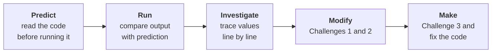
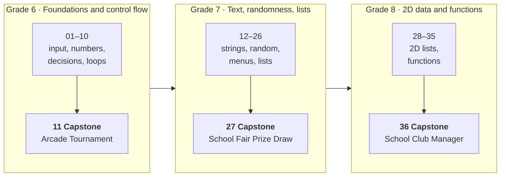

# PRIMM Python Lessons

A three-year sequence of introductory Python lessons for Grades 6 to 8. Pupils
learn from short, readable programs that they predict, run, investigate, modify,
and then use as the pattern for a program of their own.

**36 lessons** &nbsp;·&nbsp; **3 grades** &nbsp;·&nbsp; **3 capstones** &nbsp;·&nbsp; **CC BY 4.0**



The approach follows PRIMM, described by Sue Sentance and Jane Waite in
[PRIMM: Exploring pedagogical approaches for teaching text-based programming
in school](https://doi.org/10.1145/3137065.3137084).

---

## Curriculum



<details>
<summary><b>Grade 6</b> &nbsp; Foundations and control flow</summary>

| Lesson | Focus |
| --- | --- |
| 01 Hello Python! | Input, output, variables, and strings |
| 02 Operators and Integers | Whole-number input, `int()`, variables, and arithmetic |
| 03 Decimal Numbers | Decimal input, `float()`, and arithmetic |
| 04 Decisions | `if`/`else`, Boolean conditions, and indentation |
| 05 More Decisions | Ordered `if`/`elif`/`else` choices |
| 06 Logical Choices | Combining conditions with `and` and `or` |
| 07 Nested Decisions | A decision inside another decision |
| 08 Counted Loops | Repetition with `for` and `range()` |
| 09 Condition Loops | Repetition with `while`, conditions, and counters |
| 10 Choosing Loop Structures | Selecting and combining appropriate loop structures |
| **11 Arcade Tournament** | **Capstone:** a multi-round score game combining input, decisions, and loops |

</details>

<details>
<summary><b>Grade 7</b> &nbsp; Text, randomness, menus, and lists</summary>

| Lesson | Focus |
| --- | --- |
| 12 Strings and Text | Cleaning and formatting text with string methods |
| 13 String Positions | Reading characters and substrings with indexes and slices |
| 14 Changing Text Case | Normalising text with upper- and lower-case methods |
| 15 Joining Text | Building new strings by concatenation |
| 16 Text Length and Lines | Measuring strings and arranging output across lines |
| 17 Lists | Creating, displaying, and appending to ordered collections |
| 18 Random Whole Numbers | Generating bounded random integers |
| 19 Random Steps and Choices | Random stepped values and choices from a list |
| 20 Reliable Menus | Repeating and validating a menu with a Boolean flag |
| 21 Character Codes | Converting between characters and numeric codes |
| 22 List Positions and Updates | Reading and replacing items by position |
| 23 Inserting and Removing List Items | Changing list membership by value and position |
| 24 Deleting by List Position | Removing an item when its position is known |
| 25 Working Through Lists | Visiting each item with a loop and counting with `len()` |
| 26 Building Lists with Loops | Collecting repeated input into a list |
| **27 School Fair Prize Draw** | **Capstone:** a menu-driven prize draw combining text, lists, and randomness |

</details>

<details>
<summary><b>Grade 8</b> &nbsp; Two-dimensional data and functions</summary>

| Lesson | Focus |
| --- | --- |
| 28 Reading 2D Lists | Representing records as rows and reading rows or cells |
| 29 Updating 2D List Cells | Replacing one field in a selected row |
| 30 Changing 2D List Rows | Appending, inserting, and deleting complete records |
| 31 Searching 2D Lists | Finding a record and handling a not-found result |
| 32 Functions | Defining and calling a reusable procedure |
| 33 Functions with Results | Passing parameters and returning a result |
| 34 Several Functions | Dividing a program into separate responsibilities |
| 35 Functions with 2D Data | Passing record data into display and search functions |
| **36 School Club Manager** | **Capstone:** a menu of functions that show, search, add, and update 2D records |

</details>

---

## What each lesson includes

Lessons are grouped by grade in two root folders:

| Folder | For | Contents |
| --- | --- | --- |
| `Mapped Curriculum Lessons` | Pupils | Slides, starter code, challenges PDF |
| `Mapped Curriculum Lesson - Supplemental Material` | Teachers | Worksheet, concept sheet, solutions |

| Resource | Purpose |
| --- | --- |
| **Slides** | Introduce the example, guide PRIMM discussion, present three challenges, and finish with debugging. Slides never show solutions, so they can be presented directly to a class. |
| **Starter code** | The complete example program used for prediction, running, investigation, and modification. |
| **Challenges PDF** | A printable one-page copy of the example and the three challenges. |
| **Worksheet** | Records predictions, observations, investigation answers, challenge work, debugging, testing, and reflection. |
| **Concept sheet** | Summarises the lesson's vocabulary, syntax, and small code examples. |
| **Solutions** | All three challenges, plus the broken debugging program and its corrected version. |

Capstones have a smaller set: slides, a challenges PDF, and solutions. Each
capstone challenge states a goal, gives numbered steps and test cases, and ends
with a discussion question.

---

## Teaching a lesson

| Stage | What pupils do |
| --- | --- |
| **Predict** | Read the example without running it and say what will happen. A useful prediction names a specific value, route, repetition, or line of output. |
| **Run** | Run the unchanged program and compare the result with the prediction. An incorrect prediction is useful evidence of current understanding. |
| **Investigate** | Answer the investigation questions by tracing variables, conditions, loops, indexes, inputs, and outputs, justifying each answer with a line or value. |
| **Modify** | Complete Challenges 1 and 2, saving and testing each as a new file. |
| **Make** | Write a related program with less scaffolding in Challenge 3, then explain, test, and correct the fix-the-code program. |

### Suggested routine

1. Share the lesson goal and briefly retrieve prerequisite knowledge.
2. Open the starter code, but do not run it during prediction.
3. Collect several predictions and ask pupils to explain their reasoning.
4. Run the code with the suggested inputs and compare results.
5. Work through the investigation questions before permitting edits.
6. Model only the first change needed for Challenge 1 when support is required.
7. Have pupils save and test each challenge separately.
8. Use the fix-the-code task as a final check of understanding.
9. Review a few solutions, focusing on reasoning and tests rather than one
   "perfect" program.

The concept sheet works as vocabulary support before the lesson, a reference
during Modify, or revision afterwards. Use the full worksheet when written
evidence is needed, or the challenges PDF for a lighter practical lesson.

### Challenge scaffolding

| Challenge | Independence |
| --- | --- |
| **1** | Change the example while keeping its recognisable structure. |
| **2** | Extend it with another input, calculation, route, repetition, or data change. |
| **3** | Make a new but closely related program using the same core concept. |

Instructions use short sentences and direct verbs such as *ask*, *store*,
*change*, *display*, and *test*. Bracketed names such as `[total]` are
variables, quoted text is exact output, and supplied test values let pupils
check whether their program meets each requirement.

### Assessment and support

Prediction and investigation answers reveal misconceptions before editing
begins. Challenge programs show that pupils can apply the concept, and the Make
task shows whether they can transfer it to a related problem.

- **More support:** keep the starter code visible, trace one worked input, and
  provide the concept sheet.
- **More challenge:** ask pupils to choose their own test cases, explain why
  they are useful, or compare two correct solutions.

Avoid introducing untaught syntax just to shorten a solution; the sequence
builds complexity gradually.

---

## Building the lessons

Every lesson file is generated from the canonical records in
`src/lesson_compiler/curriculum`. Edit those records, not the generated
PowerPoint, PDF, Word, or Python files.

```bash
python3 -m venv .venv
.venv/bin/python -m pip install -e ".[dev]"
npm install
.venv/bin/lesson-compiler build
```

The build compiles and verifies every lesson, including the capstones, and
writes the results into the two root lesson folders. Run
`.venv/bin/lesson-compiler verify` to check the current folders without
rebuilding. See [AGENTS.md](AGENTS.md) for the full editing workflow.

## Licence

[Creative Commons Attribution 4.0 International](LICENSE)
